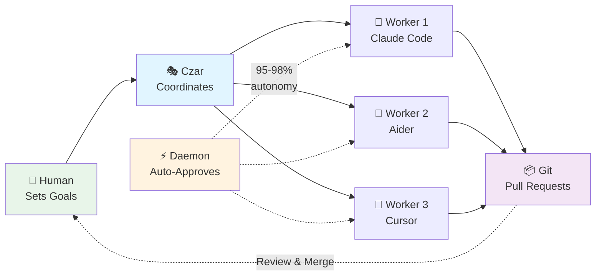

# Czarina: Multi-Agent Orchestration System

**Orchestrate multiple AI coding agents working in parallel on complex software projects**

[]() [](LICENSE)

Czarina enables autonomous teams of AI agents (Claude Code, Aider, Cursor, etc.) to collaborate on software development with 90% autonomy and 3-4x speedup.

---

## 🎯 How It Works



**The Flow:**
1. **Human** sets project goals and worker roles
2. **Czar** (Claude Code) launches and monitors workers autonomously
3. **Daemon** auto-approves file operations (90% reduction in manual intervention)
4. **Workers** code in parallel on isolated branches
5. **Git** collects work via pull requests
6. **Human** reviews and merges

**The Czar is YOU (Claude Code)** - You monitor all workers, manage the daemon, track token budgets, and coordinate the orchestration. See [docs/guides/CZAR_ROLE.md](docs/guides/CZAR_ROLE.md) for details.

---

## ⚡ Quick Start

```bash
# 1. Install Czarina (one-time)
git clone https://github.com/apathy-ca/czarina.git ~/Source/GRID/claude-orchestrator
ln -s ~/Source/GRID/claude-orchestrator/czarina ~/.local/bin/czarina
czarina patterns update

# 2. Initialize in your project
cd ~/my-projects/awesome-app
czarina init

# 3. Configure workers
nano .czarina/config.json
nano .czarina/workers/backend.md
nano .czarina/workers/frontend.md

# 4. Launch!
czarina launch
czarina daemon start
```

**See [QUICK_START.md](QUICK_START.md) for complete 5-minute guide.**

---

## 🌟 Key Features

- 🤖 **Agent-Agnostic** - Works with 8+ AI coding assistants (Claude Code, Aider, Cursor, Windsurf, etc.)
- ⚡ **90% Autonomy** - Daemon system reduces manual intervention from 100% to ~10%
- 🎯 **Embedded** - `.czarina/` lives in your project (like `.git/`)
- 🔀 **Git Native** - Automated branching, PRs, and safe integration
- 📊 **Battle-Tested** - SARK v2.0: 10 workers, 3-4x speedup
- 📚 **Pattern Library** - 30-50% faster debugging with proven patterns

---

## 🤖 Supported Agents

| Agent | Autonomy | Best For |
|-------|----------|----------|
| **Aider** | 95-98% | Full automation |
| **Windsurf** | 85-95% | AI-native IDE |
| **Cursor** | 80-90% | VS Code users |
| **Claude Code** | 70-80% | Desktop UI |
| **Continue.dev** | 75-85% | Local/free |
| **GitHub Copilot** | 70-80% | GitHub integration |

**See [AGENT_COMPATIBILITY.md](AGENT_COMPATIBILITY.md) for detailed comparison.**

---

## 📊 Real-World Results

### SARK v2.0 Project
- **Team:** 10 AI workers (6 engineers, 2 QA, 2 docs)
- **Timeline:** 6-8 weeks (vs. 22-26 weeks sequential)
- **Speedup:** 3-4x faster delivery
- **Autonomy:** 90% with daemon
- **Status:** ✅ Active development

**See [projects/sark-v2-orchestration/](projects/sark-v2-orchestration/) for details.**

---

## 🛠️ CLI Reference

```bash
# Project Management
czarina init              # Initialize in current directory
czarina list              # List all projects
czarina launch            # Launch workers
czarina status            # Show status

# Daemon (Auto-Approval)
czarina daemon start      # Start auto-approval
czarina daemon stop       # Stop daemon
czarina daemon logs       # View logs

# Pattern Library
czarina patterns update   # Get latest patterns
czarina patterns pending  # List discoveries to share
```

---

## 📖 Documentation

### Getting Started
- **[QUICK_START.md](QUICK_START.md)** - 5-minute guide
- **[docs/guides/CZAR_ROLE.md](docs/guides/CZAR_ROLE.md)** - **You are the Czar** (critical!)
- **[PRODUCTION_READINESS.md](PRODUCTION_READINESS.md)** - Production checklist
- **[docs/guides/WORKER_SETUP_GUIDE.md](docs/guides/WORKER_SETUP_GUIDE.md)** - Worker configuration

### Advanced
- **[czarina-core/docs/DAEMON_SYSTEM.md](czarina-core/docs/DAEMON_SYSTEM.md)** - Auto-approval system
- **[czarina-core/patterns/](czarina-core/patterns/)** - Error recovery & best practices
- **[docs/guides/SUPPORTED_AGENTS.md](docs/guides/SUPPORTED_AGENTS.md)** - Agent comparison
- **[docs/](docs/)** - Full documentation hub

---

## 🤝 Contributing

**Found a bug? Have an improvement?**

Use the inbox system:
```bash
cp czarina-inbox/templates/FIX_DONE.md czarina-inbox/fixes/$(date +%Y-%m-%d)-my-fix.md
```

**Discovered a pattern?**

Share it with the community:
```bash
czarina patterns pending      # Check what's ready
czarina patterns contribute   # Submit upstream
```

**See [czarina-inbox/README.md](czarina-inbox/README.md) for details.**

---

## 💡 Use Cases

**Ideal for:**
- ✅ Large refactors across multiple files
- ✅ Parallel feature development
- ✅ Documentation generation
- ✅ Test writing and coverage
- ✅ Multi-language projects

**Not ideal for:**
- ❌ Small, focused tasks (< 1 hour)
- ❌ Highly coupled code requiring tight coordination
- ❌ Tasks requiring human creativity/judgment

---

## 📂 Repository Structure

```
czarina-orchestrator/
├── czarina                    # Main CLI executable
├── .cursorrules               # Agent-agnostic development rules
├── QUICK_START.md             # 5-minute getting started
├── PRODUCTION_READINESS.md    # Production checklist
├── AGENT_COMPATIBILITY.md     # Agent comparison matrix
│
├── czarina-core/              # Framework & CLI
│   ├── daemon/                # Auto-approval system
│   ├── patterns/              # Error recovery & best practices
│   └── docs/                  # Framework documentation
│
├── czarina-inbox/             # Community improvements
│   ├── fixes/                 # Bug fixes & improvements
│   ├── patterns/              # Pattern discoveries
│   └── templates/             # Submission templates
│
├── agents/                    # Agent profiles & launchers
│   ├── profiles/              # JSON agent definitions
│   └── guides/                # Agent-specific setup
│
├── docs/                      # Documentation
│   ├── guides/                # User guides
│   ├── analysis/              # Session reports
│   └── archive/               # Legacy docs
│
└── projects/                  # Example projects
    └── sark-v2-orchestration/ # 10-worker real-world project
```

---

## 🌟 Status

**Production Ready** ✅
- Multi-agent orchestration (8+ agents)
- Autonomous daemon (90% autonomy)
- Git workflow automation
- Real-world tested (10 workers)
- Pattern library (auto-updating)

**Active Development** 🚧
- Web dashboard
- Enhanced monitoring
- More agent profiles

---

## 📜 License

MIT License - see [LICENSE](LICENSE)

---

*Built with ❤️ by humans and AI working together*

**Ready to orchestrate?** → [Quick Start Guide](QUICK_START.md) 🚀
