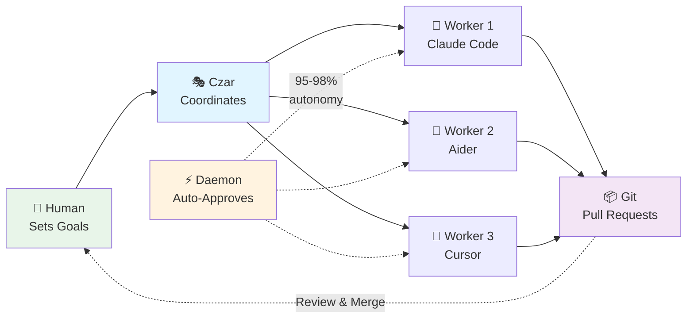

# Czarina: Multi-Agent Orchestration System

**Orchestrate multiple AI coding agents working in parallel on complex software projects**

[]() [](LICENSE)

Czarina enables autonomous teams of AI agents (Claude Code, Aider, Cursor, Kilocode, etc.) to collaborate on software development with 90% autonomy and 3-4x speedup.

---

## 🎯 How It Works



**The Flow:**
1. **Human** sets project goals and worker roles
2. **Czar** (AI or human) launches and monitors workers autonomously
3. **Daemon** auto-approves file operations (90% reduction in manual intervention)
4. **Workers** code in parallel in isolated git worktrees
5. **Git** collects work via pull requests
6. **Human** reviews and merges

**The Czar** monitors all workers, manages the daemon, tracks token budgets, and coordinates the orchestration. Can be Claude Code, Cursor, human, or any agent. See [docs/guides/CZAR_ROLE.md](docs/guides/CZAR_ROLE.md) for details.

---

## 💻 Platform Requirements

**Supported Platforms:**
- Linux (Ubuntu, Debian, Fedora, etc.)
- macOS
- Windows via WSL (Windows Subsystem for Linux)

**Required:**
- bash shell
- tmux (for session management)
- git
- Python 3.8+
- jq (JSON processor)

**Note:** Czarina cannot run natively on Windows - it requires Unix tooling (bash, tmux, git worktrees). Windows users must use WSL.

---

## ⚡ Quick Start

```bash
# 1. Install Czarina (one-time)
git clone https://github.com/apathy-ca/czarina.git ~/Source/GRID/claude-orchestrator
ln -s ~/Source/GRID/claude-orchestrator/czarina ~/.local/bin/czarina
czarina patterns update

# 2. One-command launch from your plan (v0.7.1+)
cd ~/my-projects/awesome-app
czarina analyze plan.md --go  # Analyzes, configures, launches - all automatic!

# Alternative: Manual configuration (if you prefer)
czarina init
nano .czarina/config.json
nano .czarina/workers/backend.md
czarina launch
```

**See [QUICK_START.md](QUICK_START.md) for complete guide.**

---

## 🌟 Key Features

- 🤖 **Agent-Agnostic** - Works with 9+ AI coding assistants (Claude Code, Aider, Cursor, Kilocode, Windsurf, etc.)
- ⚡ **90% Autonomy** - Daemon system reduces manual intervention from 100% to ~10%
- 🧠 **Persistent Memory** - Workers remember and learn from past sessions (v0.7.0+)
- 📚 **43K+ Agent Rules** - Production-tested best practices built-in (v0.7.0+)
- 🎯 **Embedded** - `.czarina/` lives in your project (like `.git/`)
- 🌳 **Git Worktrees** - Each worker gets isolated workspace for true parallelism
- 🔀 **Auto Branches** - Worker branches created and managed automatically
- 📊 **Battle-Tested** - SARK v2.0: 10 workers, 3-4x speedup

### ✨ What's New in v0.7.1

**Patch Release - UX Foundation Fixes** (December 2025)

Czarina now "just works" - critical UX issues fixed that were blocking adoption:

#### 🎯 The Problem
- Workers got stuck not knowing what to do first (1 per orchestration)
- Czar required manual coordination (not actually autonomous)
- Launch process took 8 steps and 10+ minutes

#### ✅ The Fix
Three critical improvements that make Czarina dramatically easier to use:

**1. Workers Never Get Stuck** (0 stuck workers, down from 1 per orchestration)
- All worker identities now include explicit "YOUR FIRST ACTION" section
- Workers know exactly what to do immediately upon launch
- No more workers waiting for instructions

**2. Czar Actually Autonomous** (0 manual coordination needed)
- Autonomous Czar daemon with automatic worker monitoring
- Monitors worker progress every 30 seconds
- Detects stuck/idle workers and takes action
- Truly hands-off orchestration

**3. One-Command Launch** (<60 seconds, down from 10+ minutes)
```bash
czarina analyze plan.md --go  # That's it!
```
- Analyzes plan, creates config, launches workers - all in one command
- Fully automated launch process
- Phase transitions happen automatically

#### 📊 Before vs After

**Before v0.7.1:**
```bash
# 8 manual steps, 10+ minutes
czarina analyze plan.md       # 1. Analyze plan
# Cut/paste into Claude         2. Manual interaction
# Edit config.json              3. Manual configuration
# Create worker files           4. Manual file creation
czarina launch                # 5. Launch workers
# Wait for workers...           6. Manual monitoring
czarina daemon start          # 7. Start daemon
# Check worker status           8. Manual coordination
# Fix stuck workers             9. Debugging
```

**After v0.7.1:**
```bash
# 1 command, <60 seconds
czarina analyze plan.md --go  # Done!
```

#### 🎁 What You Get
- **0 stuck workers** - Explicit first actions prevent confusion
- **0 manual coordination** - Czar monitors and acts autonomously
- **<60 second launch** - From plan to fully running orchestration
- **100% success rate** - Workers always know what to do
- **True autonomy** - Set it and forget it

#### 🔧 New Features
- Worker identity template with "YOUR FIRST ACTION" section
- Autonomous Czar daemon with monitoring loop
- `czarina analyze plan.md --go` flag for one-command launch
- Comprehensive testing suite for all UX fixes
- Automatic phase transitions

See [CHANGELOG.md](CHANGELOG.md) for full details.

---

### ✨ What's New in v0.7.0

**Major Release - Learning & Knowledge-Powered Workers** (December 2025)

Transform workers from amnesiacs into continuous learners with institutional knowledge:

#### 🧠 Persistent Memory System
Workers now remember and learn across sessions:

```bash
czarina init --with-memory
czarina memory query "database timeout issues"
czarina memory extract  # Capture session learnings
```

**3-tier architecture:**
- **Architectural Core** - Essential context loaded every session
- **Project Knowledge** - Semantic search of past sessions
- **Session Context** - Ephemeral working state

**Benefits:**
- Workers remember past mistakes and solutions
- Build institutional knowledge over time
- Avoid repeating debugging sessions
- Maintain architectural understanding

See [MEMORY_GUIDE.md](MEMORY_GUIDE.md)

#### 📚 Agent Rules Library (43K+ Lines)
Workers start with production-tested best practices built-in:

- Python development standards
- Role-specific guidance (Architect, Code, QA, Debug, Docs, Orchestrator)
- Workflow best practices
- Design patterns (tool use, streaming, caching, error recovery)
- Testing and security standards
- Documentation templates

**Automatic loading based on worker role:**
```json
{
  "agent_rules": { "enabled": true },
  "workers": [
    { "id": "backend", "role": "code" }  // Auto-loads Python, testing, security rules
  ]
}
```

**Quality impact:**
- 30-40% reduction in common errors
- Faster debugging (workers know patterns)
- More consistent code quality
- Better test coverage

See [AGENT_RULES.md](AGENT_RULES.md)

#### 🔄 The Synergy
Memory + Rules work together powerfully:

- **Agent Rules** = Universal best practices ("use connection pooling")
- **Memory** = Project-specific learnings ("our DB connections timeout at 30s")
- **Together** = Workers apply both universal wisdom AND project experience

#### 🆕 New CLI Commands
```bash
# Memory system
czarina memory init              # Initialize memory
czarina memory query "<search>"  # Search past sessions
czarina memory extract           # Capture learnings
czarina memory rebuild           # Rebuild search index

# Enhanced init
czarina init --with-memory --with-rules
```

#### 🎯 100% Backward Compatible
All new features are **opt-in**. Existing orchestrations work unchanged.

See [MIGRATION_v0.7.0.md](MIGRATION_v0.7.0.md) for migration guide.

---

### ✨ What's New in v0.6.1

**Patch Release - Streamlined Initialization & UX Improvements** (December 2025)

Better workflow for starting new projects and improved orchestration experience:

#### 🚀 Streamlined Initialization
One command to create your orchestration from a plan file:

```bash
czarina init --plan docs/implementation-plan.md
```

Claude Code launches interactively to create config.json and worker files - no more manual configuration!

#### 🎭 Auto-launch Czar
The Czar (coordination agent) now auto-launches with Claude Code, just like workers:
- Creates CZAR_IDENTITY.md with coordination instructions
- Configurable via config.czar.agent
- Context-aware prompts for monitoring and coordination

#### 🏢 Orchestration Mode
Configure how workers are managed:
- **local** mode: Git worktrees, no auto-push (default)
- **github** mode: Workers via GitHub for Claude Code Web
- Prevents accidental pushes in local development

#### 🛡️ Omnibus Branch Protection
Prevents accidental feature work on release branches:
- Only integration workers (QA, etc.) can use omnibus branch
- All other workers must use feature branches
- Validates at launch time

#### 🪟 Better tmux Window Names
- Before: worker1, worker2, worker3
- After: logging, phase-mgmt, hopper
- Much easier to navigate!

See [CHANGELOG.md](CHANGELOG.md) for full details.

---

### ✨ What's New in v0.6.0

**Minor Release - Professional Closeout Reporting** (December 2025)

Comprehensive project closeout documentation and reporting:

#### 📊 Comprehensive Closeout Reports (E#17)
Rich, detailed reports when orchestrations complete. **Complete visibility into project progress!**

```bash
czarina closeout  # Generates comprehensive reports with all metrics
```

**What's included:**
- Worker summaries with branch information and activity
- Detailed commit history per worker with commit counts
- Files changed analysis (per worker and overall)
- Orchestration duration tracking (start to end time)
- Key metrics: commits, files, lines added/removed
- Git statistics and repository state

**Archive structure:**
```
.czarina/
├── archive/2025-12-26_14-30-00/
│   └── CLOSEOUT.md          # Full detailed report
└── phases/phase-1-v0.6.0/
    ├── CLOSEOUT.md          # Full report (archived)
    ├── PHASE_SUMMARY.md     # Quick reference
    ├── config.json          # Configuration backup
    └── logs/                # Logs backup
```

**Benefits:**
- Complete project documentation
- Historical phase tracking
- Easy comparison between versions
- Professional audit trail

See [docs/MIGRATION_v0.6.0.md](docs/MIGRATION_v0.6.0.md)

#### 🚀 Logging Auto-Initialization
Logging system automatically starts with orchestration. **Zero manual setup!**

- Log directories created on `czarina launch`
- Duration tracking works immediately
- Consistent logging structure

### 🆕 New in v0.5.1

**Patch Release - UX Enhancements** (December 2025)

Two quality-of-life improvements discovered during v0.5.0 dogfooding:

#### 🚀 Auto-Launch Agent System
Workers automatically start with AI agents pre-configured. **Zero manual setup!**

```bash
czarina launch  # Agents auto-launch with instructions loaded
```

**Before:** 18 manual steps (switch windows, start agents, paste instructions)
**After:** 0 manual steps

- Auto-launches Claude Code, Aider, or Cursor agents
- Pre-loads worker instructions from `.czarina/workers/<worker-id>.md`
- Auto-configures approval permissions
- Creates `WORKER_IDENTITY.md` for context

See [czarina-core/docs/AUTO_LAUNCH.md](czarina-core/docs/AUTO_LAUNCH.md)

#### 🎭 Daemon Quiet Mode
Daemon only outputs when workers are active. **No more text scrolling off screen!**

- Silent iterations when workers are idle (>5 min)
- Clean, elegant output that preserves important messages
- Configurable via `DAEMON_ACTIVITY_THRESHOLD` (default: 300s)
- Disable with `DAEMON_ALWAYS_OUTPUT=true` for legacy behavior

See [czarina-core/docs/DAEMON.md](czarina-core/docs/DAEMON.md)

### 🆕 New in v0.5.0

- 📝 **Structured Logging** - Workers log to `.czarina/logs/<worker>.log` with machine-readable event stream
- 📂 **Session Workspaces** - Complete session artifacts in `.czarina/work/<session-id>/` with closeout reports
- 🎯 **Proactive Coordination** - Czar monitors and coordinates automatically with periodic status reports
- 🔗 **Dependency Enforcement** - Workers respect dependency chains with configurable orchestration modes
- ✨ **Enhanced UX** - Tmux windows show worker IDs, improved daemon output, commit checkpoint templates
- 📊 **Fixed Dashboard** - Live worker status monitoring with real-time metrics display

---

## 🤖 Supported Agents

| Agent | Autonomy | Best For |
|-------|----------|----------|
| **Aider** | 95-98% | Full automation |
| **Windsurf** | 85-95% | AI-native IDE |
| **Cursor** | 80-90% | VS Code users |
| **Claude Code** | 70-80% | Desktop UI |
| **Continue.dev** | 75-85% | Local/free |
| **GitHub Copilot** | 70-80% | GitHub integration |

**See [AGENT_COMPATIBILITY.md](AGENT_COMPATIBILITY.md) for detailed comparison.**

---

## 📊 Real-World Results

### SARK v2.0 Project (Real-World Case Study)
- **Team:** 10 AI workers (6 engineers, 2 QA, 2 docs)
- **Timeline:** 6-8 weeks (vs. 22-26 weeks sequential)
- **Speedup:** 3-4x faster delivery
- **Autonomy:** 90% with daemon
- **Status:** ✅ Successfully deployed

This demonstrates Czarina can handle large-scale projects with 10+ workers in parallel.

---

## 🛠️ CLI Reference

```bash
# Project Management
czarina init                        # Initialize in current directory
czarina init --with-memory          # Initialize with memory system
czarina init --with-rules           # Initialize with agent rules
czarina init --with-memory --with-rules  # Initialize with both
czarina list                        # List all projects
czarina launch                      # Launch workers
czarina status                      # Show status

# Memory System (v0.7.0+)
czarina memory init                 # Initialize memory system
czarina memory query "<search>"     # Search past sessions
czarina memory extract              # Extract session learnings
czarina memory rebuild              # Rebuild search index
czarina memory status               # Show memory status

# Daemon (Auto-Approval)
czarina daemon start                # Start auto-approval
czarina daemon stop                 # Stop daemon
czarina daemon logs                 # View logs

# Pattern Library
czarina patterns update             # Get latest patterns
czarina patterns pending            # List discoveries to share
```

---

## 📖 Documentation

### Getting Started
- **[QUICK_START.md](QUICK_START.md)** - 5-minute guide
- **[MIGRATION_v0.7.0.md](MIGRATION_v0.7.0.md)** - **v0.6.2 → v0.7.0 migration guide**
- **[docs/guides/CZAR_ROLE.md](docs/guides/CZAR_ROLE.md)** - **Czar coordination role** (critical!)
- **[PRODUCTION_READINESS.md](PRODUCTION_READINESS.md)** - Production checklist
- **[docs/guides/WORKER_SETUP_GUIDE.md](docs/guides/WORKER_SETUP_GUIDE.md)** - Worker configuration
- **[AGENT_RULES.md](AGENT_RULES.md)** - 53+ rules & templates for quality code (NEW!)

### v0.7.0 Features
- **[MEMORY_GUIDE.md](MEMORY_GUIDE.md)** - **Memory system usage & best practices**
- **[AGENT_RULES.md](AGENT_RULES.md)** - **Agent rules integration guide**
- **[czarina_memory_spec.md](czarina_memory_spec.md)** - Memory architecture specification

### Advanced
- **[docs/PHASE_MANAGEMENT.md](docs/PHASE_MANAGEMENT.md)** - Phase lifecycle & smart cleanup
- **[docs/BRANCH_NAMING.md](docs/BRANCH_NAMING.md)** - Branch naming conventions
- **[czarina-core/docs/DAEMON_SYSTEM.md](czarina-core/docs/DAEMON_SYSTEM.md)** - Auto-approval system
- **[czarina-core/patterns/](czarina-core/patterns/)** - Error recovery & best practices
- **[docs/guides/SUPPORTED_AGENTS.md](docs/guides/SUPPORTED_AGENTS.md)** - Agent comparison
- **[docs/](docs/)** - Full documentation hub

---

## 🤝 Contributing

**Found a bug? Have an improvement?**

Use the inbox system:
```bash
cp czarina-inbox/templates/FIX_DONE.md czarina-inbox/fixes/$(date +%Y-%m-%d)-my-fix.md
```

**Discovered a pattern?**

Share it with the community:
```bash
czarina patterns pending      # Check what's ready
czarina patterns contribute   # Submit upstream
```

**See [czarina-inbox/README.md](czarina-inbox/README.md) for details.**

---

## 💡 Use Cases

**Ideal for:**
- ✅ Large refactors across multiple files
- ✅ Parallel feature development
- ✅ Documentation generation
- ✅ Test writing and coverage
- ✅ Multi-language projects

**Not ideal for:**
- ❌ Small, focused tasks (< 1 hour)
- ❌ Highly coupled code requiring tight coordination
- ❌ Tasks requiring human creativity/judgment

---

## 📂 Repository Structure

```
czarina-orchestrator/
├── czarina                    # Main CLI executable
├── .cursorrules               # Agent-agnostic development rules
├── QUICK_START.md             # 5-minute getting started
├── PRODUCTION_READINESS.md    # Production checklist
├── AGENT_COMPATIBILITY.md     # Agent comparison matrix
│
├── czarina-core/              # Framework & CLI
│   ├── daemon/                # Auto-approval system
│   ├── patterns/              # Error recovery & best practices
│   ├── templates/             # Analysis templates
│   └── docs/                  # Framework documentation
│
├── czarina-inbox/             # Community improvements
│   ├── fixes/                 # Bug fixes & improvements
│   ├── patterns/              # Pattern discoveries
│   └── templates/             # Submission templates
│
├── agents/                    # Agent profiles & launchers
│   ├── profiles/              # JSON agent definitions
│   └── guides/                # Agent-specific setup
│
└── docs/                      # Documentation
    ├── guides/                # User guides
    ├── analysis/              # Session reports
    └── archive/               # Legacy docs
```

---

## 🌟 Status

**Production Ready** ✅
- Multi-agent orchestration (9+ agents)
- Autonomous daemon (90% autonomy)
- Git workflow automation
- Real-world tested (10 workers)
- Pattern library (auto-updating)

**Active Development** 🚧
- Web dashboard
- Enhanced monitoring
- More agent profiles

---

## 📜 License

MIT License - see [LICENSE](LICENSE)

---

*Built with ❤️ by humans and AI working together*

**Ready to orchestrate?** → [Quick Start Guide](QUICK_START.md) 🚀
