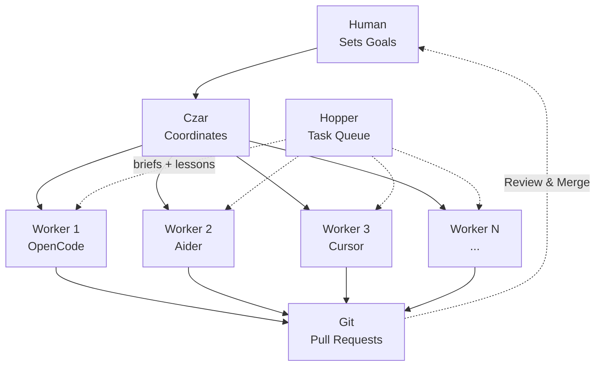

# Czarina: Multi-Agent Orchestration System

**Orchestrate multiple AI coding agents working in parallel on complex software projects**

[]() [](LICENSE) []()

Czarina enables autonomous teams of AI coding agents (OpenCode, Claude, Aider, Cursor, Kilocode, Windsurf, and more) to collaborate on software development with 95-98% autonomy and 3-4x speedup.

---

## How It Works


```mermaid
graph TB
    H[Human<br/>Sets Goals] --> C[Czar<br/>Coordinates]

    C --> W1[Worker 1<br/>OpenCode]
    C --> W2[Worker 2<br/>Aider]
    C --> W3[Worker 3<br/>Cursor]
    C --> Wn[Worker N<br/>...]

    HP[Hopper<br/>Task Queue] -.->|briefs + lessons| W1
    HP -.-> W2
    HP -.-> W3
    HP -.-> Wn

    W1 --> G[Git<br/>Pull Requests]
    W2 --> G
    W3 --> G
    Wn --> G

    G -.->|Review & Merge| H
```

**The Flow:**
1. **Human** writes a project plan
2. **`czarina plan`** uses AI to break it into worker briefs
3. **`czarina init`** creates the orchestration setup
4. **`czarina launch`** registers everything in Hopper and starts workers
5. **Workers** pull their full briefs from Hopper, work in parallel in isolated git worktrees
6. **Hopper** stores instructions persistently — workers recover from crashes without intervention
7. **Git** collects work via pull requests
8. **Human** reviews and merges

---

## Requirements

### Platform
- Linux, macOS, or Windows via WSL
- bash, tmux, git, Python 3.11+, jq

### Required Dependencies

| Dependency | Purpose | Install |
|------------|---------|---------|
| **hopper** | Task queue and persistent instruction store | `pip install hopper-cli` |
| **tmux** | Session management for parallel workers | `sudo apt install tmux` |
| **jq** | JSON processing | `sudo apt install jq` |
| **git** | Version control and worktree management | system package |
| **Python 3.11+** | CLI runtime | [python.org](https://python.org) |

**Hopper is a required dependency.** Czarina will not launch without it. `czarina validate` checks all requirements before launch.

---

## Installation

```bash
# 1. Install hopper (required)
pip install hopper-cli

# 2. Clone czarina
git clone https://github.com/apathy-ca/czarina.git ~/czarina

# 3. Add to PATH
ln -s ~/czarina/czarina ~/.local/bin/czarina
echo 'export PATH="$HOME/.local/bin:$PATH"' >> ~/.bashrc
source ~/.bashrc

# 4. Verify
czarina version
hopper --version
```

---

## Quick Start

```bash
# In your project directory:

# 1. Write a plan (or use an existing one)
# docs/my-plan.md — describe what you want to build

# 2. Generate worker structure from your plan
czarina plan docs/my-plan.md

# 3. Initialize the orchestration (AI reads the plan, creates worker briefs)
czarina init docs/my-plan.md

# 4. Validate everything is ready
czarina validate

# 5. Launch — registers workers in Hopper and starts the tmux session
czarina launch

# 6. Monitor
czarina status
```

**See [QUICK_START.md](QUICK_START.md) for a complete step-by-step guide.**

---

## Key Features

- **Agent-Agnostic** — Works with OpenCode, Claude, Aider, Cursor, Kilocode, Windsurf, and more
- **Persistent Instructions** — Worker briefs live in Hopper; workers recover from crashes without orchestrator intervention
- **Lesson Propagation** — Workers file lessons in Hopper; subsequent workers see them automatically in their briefs
- **Session Recovery** — A worker that loses context runs one command and has their full brief back
- **95-98% Autonomy** — Daemon auto-approval reduces manual intervention
- **Git Worktrees** — Each worker gets an isolated workspace for true parallelism
- **Multi-Phase** — Sequential phases with automatic archival and phase-to-phase lesson carry-forward
- **Wiggum Mode** — Iterative, fault-tolerant tasks with automatic retry and verification
- **43K+ Agent Rules** — Production-tested best practices from the agent-knowledge library

---

## Supported Agents

| Agent | Autonomy | Best For |
|-------|----------|----------|
| **OpenCode** | 90-95% | Default; full TUI with git and PR support |
| **Aider** | 95-98% | Full automation, rapid iteration |
| **Windsurf** | 85-95% | AI-native IDE, cascade workflows |
| **Cursor** | 80-90% | VS Code users, UI/UX work |
| **Claude** | 70-80% | Architecture, complex reasoning |
| **Kilocode** | 80-90% | Performance, large codebases |
| **GitHub Copilot** | 70-80% | GitHub integration |

See [AGENT_COMPATIBILITY.md](AGENT_COMPATIBILITY.md) for the full matrix.

---

## CLI Reference

```bash
# Planning & Setup
czarina plan <file>              # Generate worker structure from a plan file
czarina init <file>              # AI-assisted setup: reads plan, creates worker briefs
czarina validate                 # Check all requirements (hopper, agents, config)

# Orchestration
czarina launch                   # Register workers in Hopper and start tmux session
czarina status                   # Show project status and Hopper task state
czarina closeout                 # Stop workers, close Hopper tasks, archive phase

# Phase Management
czarina phase list               # Show completed phases
czarina phase close              # Archive current phase
czarina phase set <n>            # Change phase number

# Learnings
czarina learnings show           # Show learnings from current phase
czarina learnings history        # Show learnings across all phases
czarina learnings northbound     # Promote learnings upward

# Wiggum Mode (iterative AI tasks with retry)
czarina wiggum '<task>'                          # Run with config defaults
czarina wiggum '<task>' --verify-command 'make test'  # With test gate
czarina wiggum '<task>' --retries 3 --timeout 600     # Custom limits

# Pattern Library
czarina patterns update          # Sync latest agent-knowledge patterns
czarina patterns version         # Show current version
```

---

## How Hopper Integration Works

When `czarina launch` runs:

1. Creates a Hopper task for the project and one per worker
2. Stores each worker's full `.czarina/workers/<id>.md` brief as the Hopper task body
3. Injects any relevant high-confidence lessons from previous work into each brief
4. Workers receive a `WORKER_IDENTITY.md` with their Hopper task ID and the exact command to read their brief

When a worker starts:
```bash
# They run this to get their full brief:
hopper task get <task-id> --with-lessons
```

If a worker loses their session:
```bash
# Recovery — no orchestrator needed:
hopper task list --tag worker-<id> --status in_progress
hopper task get <task-id> --with-lessons
```

When a worker completes a task, they file lessons:
```bash
hopper lesson add --task <id> --domain python --confidence high ...
```

Those lessons are automatically injected into the next phase's worker briefs.

---

## Documentation

### Getting Started
- **[QUICK_START.md](QUICK_START.md)** — Step-by-step guide
- **[AGENT_COMPATIBILITY.md](AGENT_COMPATIBILITY.md)** — Agent comparison and setup
- **[docs/guides/CZAR_ROLE.md](docs/guides/CZAR_ROLE.md)** — Czar coordination role
- **[docs/guides/WORKER_SETUP_GUIDE.md](docs/guides/WORKER_SETUP_GUIDE.md)** — Worker configuration

### Core Concepts
- **[docs/HOPPER.md](docs/HOPPER.md)** — Hopper integration: persistent instructions and lessons
- **[docs/CONFIGURATION.md](docs/CONFIGURATION.md)** — Full config.json reference
- **[docs/PHASE_MANAGEMENT.md](docs/PHASE_MANAGEMENT.md)** — Phase lifecycle and archival
- **[docs/MULTI_PHASE_ORCHESTRATION.md](docs/MULTI_PHASE_ORCHESTRATION.md)** — Multi-phase guide

### Advanced
- **[czarina-core/docs/LLM_MONITOR.md](czarina-core/docs/LLM_MONITOR.md)** — LLM monitoring daemon
- **[czarina-core/docs/DAEMON_SYSTEM.md](czarina-core/docs/DAEMON_SYSTEM.md)** — Auto-approval daemon
- **[czarina-core/patterns/](czarina-core/patterns/)** — Error recovery and best practices
- **[CHANGELOG.md](CHANGELOG.md)** — Version history

### Testing
- **[czarina-core/tests/](czarina-core/tests/)** — Integration test suite
- Run: `bash czarina-core/tests/test-hopper-instruction-store.sh`

---

## Repository Structure

```
czarina/
├── czarina                      # Main CLI executable (Python)
├── QUICK_START.md               # Step-by-step getting started
├── AGENT_COMPATIBILITY.md       # Agent comparison matrix
├── CHANGELOG.md                 # Version history
│
├── czarina-core/                # Orchestration engine
│   ├── agent-launcher.sh        # Launches agents in tmux windows
│   ├── hopper-integration.sh    # Hopper task registration and tracking
│   ├── launch-project-v2.sh     # Main project launch script
│   ├── closeout-project.sh      # Phase closeout and archival
│   ├── validate-config.sh       # Pre-launch validation
│   ├── daemon/                  # Auto-approval daemon
│   ├── templates/               # Worker brief templates
│   ├── docs/                    # Framework documentation
│   └── tests/                   # Integration tests
│
├── agents/
│   ├── profiles/                # JSON agent definitions (opencode.json, etc.)
│   └── guides/                  # Agent-specific setup guides
│
├── docs/                        # User documentation
│   ├── guides/                  # CZAR_ROLE.md, WORKER_SETUP_GUIDE.md, etc.
│   ├── HOPPER.md                # Hopper integration guide
│   ├── CONFIGURATION.md         # config.json reference
│   ├── PHASE_MANAGEMENT.md      # Phase lifecycle
│   └── MULTI_PHASE_ORCHESTRATION.md
│
├── examples/                    # Example configs
│   ├── config-basic.json
│   ├── config-full-featured.json
│   └── config-with-wiggum.json
│
└── plans/                       # Development plans
    ├── hopper-instruction-store.md
    └── hopper-lessons-northbound.md
```

---

## Use Cases

**Ideal for:**
- Large refactors across multiple files
- Parallel feature development (different domains to different workers)
- Documentation generation alongside implementation
- Multi-phase projects with accumulated knowledge across phases
- Automated bug fixes with test verification (Wiggum Mode)

**Not ideal for:**
- Small, focused tasks (under 1 hour of work)
- Highly coupled code requiring tight real-time coordination
- Tasks requiring significant human creativity or judgment

---

## Real-World Results

### SARK v2.0 (Production Case Study)
- **Team:** 10 AI workers (6 engineers, 2 QA, 2 docs)
- **Timeline:** 6-8 weeks vs. 22-26 weeks sequential
- **Speedup:** 3-4x
- **Autonomy:** 95-98% with daemon

---

## License

MIT — see [LICENSE](LICENSE)

---

*Built with humans and AI working together*
