# Czarina: Multi-Agent Orchestration System

**Orchestrate multiple AI coding agents working in parallel on complex software projects**

[]() [](LICENSE)

Czarina enables autonomous teams of 9+ AI coding agents (Claude Code, Aider, Cursor, Kilocode, Windsurf, Cline, etc.) to collaborate on software development with 95-98% autonomy and 3-4x speedup.

---

## 🎯 How It Works

```mermaid
graph TB
    H[👤 Human<br/>Sets Goals] --> C[🎭 Czar<br/>Coordinates]

    C --> W1[👷 Worker 1<br/>Claude Code]
    C --> W2[👷 Worker 2<br/>Aider]
    C --> W3[👷 Worker 3<br/>Cursor]
    C --> W4[👷 Worker 4<br/>Kilocode]
    C --> W5[👷 Worker 5<br/>Windsurf]
    C --> W6[👷 Worker 6<br/>Cline]

    D[⚡ Daemon<br/>Auto-Approves] -.->|95-98%<br/>autonomy| W1
    D -.-> W2
    D -.-> W3
    D -.-> W4
    D -.-> W5
    D -.-> W6

    W1 --> G[📦 Git<br/>Pull Requests]
    W2 --> G
    W3 --> G
    W4 --> G
    W5 --> G
    W6 --> G

    G -.->|Review & Merge| H

    M[🧠 Memory<br/>Learns] -.->|Past Sessions| W1
    M -.-> W2
    M -.-> W3

    R[📚 Rules<br/>43K+ lines] -.->|Best Practices| W1
    R -.-> W4
    R -.-> W5

    style H fill:#e8f5e9
    style C fill:#e1f5ff
    style D fill:#fff3e0
    style G fill:#f3e5f5
    style M fill:#e3f2fd
    style R fill:#fce4ec
```



**The Flow:**
1. **Human** sets project goals and worker roles
2. **Czar** (AI or human) launches and monitors workers autonomously
3. **Daemon** auto-approves file operations (95-98% autonomy)
4. **Workers** (6+ agent types) code in parallel in isolated git worktrees
5. **Memory** provides workers with learnings from past sessions
6. **Rules** equip workers with 43K+ lines of best practices
7. **Git** collects work via pull requests
8. **Human** reviews and merges

**The Czar** monitors all workers, manages the daemon, tracks token budgets, and coordinates the orchestration. Can be Claude Code, Cursor, human, or any agent. See [docs/guides/CZAR_ROLE.md](docs/guides/CZAR_ROLE.md) for details.

---

## 💻 Platform Requirements

**Supported Platforms:**
- Linux (Ubuntu, Debian, Fedora, etc.)
- macOS
- Windows via WSL (Windows Subsystem for Linux)

**Required:**
- bash shell
- tmux (for session management)
- git
- Python 3.8+
- jq (JSON processor)

**Note:** Czarina cannot run natively on Windows - it requires Unix tooling (bash, tmux, git worktrees). Windows users must use WSL.

---

## ⚡ Quick Start

```bash
# 1. Install Czarina (one-time)
git clone https://github.com/apathy-ca/czarina.git ~/Source/GRID/claude-orchestrator
ln -s ~/Source/GRID/claude-orchestrator/czarina ~/.local/bin/czarina
czarina patterns update

# 2. One-command launch from your plan (v0.7.1+)
cd ~/my-projects/awesome-app
czarina analyze plan.md --go  # Analyzes, configures, launches - all automatic!

# Alternative: Manual configuration (if you prefer)
czarina init
nano .czarina/config.json
nano .czarina/workers/backend.md
czarina launch
```

**See [QUICK_START.md](QUICK_START.md) for complete guide.**

---

## 🌟 Key Features

- 🤖 **Agent-Agnostic** - Works with 9+ AI coding assistants (Claude Code, Aider, Cursor, Kilocode, Windsurf, Cline, Roo-Code, Continue, Copilot Edits)
- ⚡ **95-98% Autonomy** - Daemon system with auto-approval reduces manual intervention to 2-5%
- 🧠 **Persistent Memory** - Workers remember and learn from past sessions
- 📚 **43K+ Agent Rules** - Production-tested best practices built-in
- 🎯 **One-Command Launch** - `czarina analyze plan.md --go` - from plan to running in <60 seconds
- 🌳 **Git Worktrees** - Each worker gets isolated workspace for true parallelism
- 🔀 **Auto Branches** - Worker branches created and managed automatically
- 🔄 **Wiggum Mode** - Iterative, fault-tolerant AI tasks with automatic retry and verification
- 📊 **Battle-Tested** - SARK v2.0: 10 workers, 3-4x speedup

**Latest Updates:** See [CHANGELOG.md](CHANGELOG.md) for version history and recent releases.

---

## 📊 Real-World Results

### SARK v2.0 Project (Production Case Study)
- **Team:** 10 AI workers (6 engineers, 2 QA, 2 docs)
- **Timeline:** 6-8 weeks (vs. 22-26 weeks sequential)
- **Speedup:** 3-4x faster delivery
- **Autonomy:** 95-98% with daemon auto-approval
- **Status:** ✅ Successfully deployed

This demonstrates Czarina can handle large-scale projects with 10+ workers in parallel.

### ✨ Latest Release - v0.7.2 (December 2025)

**Automated Multi-Phase Orchestration**
- Automatic phase completion detection
- Seamless phase transitions
- Hands-free multi-phase projects

See [CHANGELOG.md](CHANGELOG.md) for complete release notes and migration guides.

---
## 🤖 Supported Agents

Czarina orchestrates 9+ AI coding assistants with varying autonomy levels:

| Agent | Autonomy | Best For |
|-------|----------|----------|
| **Aider** | 95-98% | Full automation, rapid iteration |
| **Windsurf** | 85-95% | AI-native IDE, cascade workflows |
| **Cursor** | 80-90% | VS Code users, UI/UX work |
| **Continue.dev** | 75-85% | Local/free, customizable |
| **Claude Code** | 70-80% | Architecture, complex reasoning |
| **Kilocode** | 80-90% | Performance, large codebases |
| **Cline** | 75-85% | Claude-powered VS Code |
| **Roo-Code** | 70-80% | Terminal-native, CLI tools |
| **GitHub Copilot** | 70-80% | GitHub integration, PR reviews |

**Mix and match** agents within a single orchestration - assign each worker the best tool for their role.

**See [AGENT_COMPATIBILITY.md](AGENT_COMPATIBILITY.md) for detailed comparison.**


## 🛠️ CLI Reference

```bash
# Project Management
czarina init                        # Initialize in current directory
czarina init --with-memory          # Initialize with memory system
czarina init --with-rules           # Initialize with agent rules
czarina init --with-memory --with-rules  # Initialize with both
czarina list                        # List all projects
czarina launch                      # Launch workers
czarina status                      # Show status

# Memory System (v0.7.0+)
czarina memory init                 # Initialize memory system
czarina memory query "<search>"     # Search past sessions
czarina memory extract              # Extract session learnings
czarina memory rebuild              # Rebuild search index
czarina memory status               # Show memory status

# Daemon (Auto-Approval)
czarina daemon start                # Start auto-approval
czarina daemon stop                 # Stop daemon
czarina daemon logs                 # View logs

# Wiggum Mode (Iterative AI Workers)
czarina wiggum '<task>'             # Run with defaults from config
czarina wiggum '<task>' --verify-command 'npm test'  # With verification
czarina wiggum '<task>' --retries 3 --timeout 600    # Custom limits

# Pattern Library
czarina patterns update             # Get latest patterns
czarina patterns pending            # List discoveries to share
```

---

## 📖 Documentation

### Getting Started
- **[QUICK_START.md](QUICK_START.md)** - 5-minute guide
- **[MIGRATION_v0.7.0.md](MIGRATION_v0.7.0.md)** - **v0.6.2 → v0.7.0 migration guide**
- **[docs/guides/CZAR_ROLE.md](docs/guides/CZAR_ROLE.md)** - **Czar coordination role** (critical!)
- **[PRODUCTION_READINESS.md](PRODUCTION_READINESS.md)** - Production checklist
- **[docs/guides/WORKER_SETUP_GUIDE.md](docs/guides/WORKER_SETUP_GUIDE.md)** - Worker configuration
- **[AGENT_RULES.md](AGENT_RULES.md)** - 53+ rules & templates for quality code (NEW!)

### v0.7.0 Features
- **[MEMORY_GUIDE.md](MEMORY_GUIDE.md)** - **Memory system usage & best practices**
- **[AGENT_RULES.md](AGENT_RULES.md)** - **Agent rules integration guide**
- **[czarina_memory_spec.md](czarina_memory_spec.md)** - Memory architecture specification

### v0.9.0 Features
- **[Wiggum Mode](czarina-core/wiggum.sh)** - Iterative fault-tolerant AI tasks with retry and verification
- **[examples/config-with-wiggum.json](examples/config-with-wiggum.json)** - Wiggum Mode configuration example

### Advanced
- **[docs/PHASE_MANAGEMENT.md](docs/PHASE_MANAGEMENT.md)** - Phase lifecycle & smart cleanup
- **[docs/BRANCH_NAMING.md](docs/BRANCH_NAMING.md)** - Branch naming conventions
- **[czarina-core/docs/DAEMON_SYSTEM.md](czarina-core/docs/DAEMON_SYSTEM.md)** - Auto-approval system
- **[czarina-core/patterns/](czarina-core/patterns/)** - Error recovery & best practices
- **[docs/guides/SUPPORTED_AGENTS.md](docs/guides/SUPPORTED_AGENTS.md)** - Agent comparison
- **[docs/](docs/)** - Full documentation hub

---

## 🤝 Contributing

**Found a bug? Have an improvement?**

Use the inbox system:
```bash
cp czarina-inbox/templates/FIX_DONE.md czarina-inbox/fixes/$(date +%Y-%m-%d)-my-fix.md
```

**Discovered a pattern?**

Share it with the community:
```bash
czarina patterns pending      # Check what's ready
czarina patterns contribute   # Submit upstream
```

**See [czarina-inbox/README.md](czarina-inbox/README.md) for details.**

---

## 💡 Use Cases

**Ideal for:**
- ✅ Large refactors across multiple files
- ✅ Parallel feature development
- ✅ Documentation generation
- ✅ Test writing and coverage
- ✅ Multi-language projects
- ✅ Automated bug fixes with test verification (Wiggum Mode)

**Not ideal for:**
- ❌ Small, focused tasks (< 1 hour)
- ❌ Highly coupled code requiring tight coordination
- ❌ Tasks requiring human creativity/judgment

---

## 📂 Repository Structure

```
czarina-orchestrator/
├── czarina                    # Main CLI executable
├── .cursorrules               # Agent-agnostic development rules
├── QUICK_START.md             # 5-minute getting started
├── PRODUCTION_READINESS.md    # Production checklist
├── AGENT_COMPATIBILITY.md     # Agent comparison matrix
│
├── czarina-core/              # Framework & CLI
│   ├── daemon/                # Auto-approval system
│   ├── patterns/              # Error recovery & best practices
│   ├── templates/             # Analysis templates
│   └── docs/                  # Framework documentation
│
├── czarina-inbox/             # Community improvements
│   ├── fixes/                 # Bug fixes & improvements
│   ├── patterns/              # Pattern discoveries
│   └── templates/             # Submission templates
│
├── agents/                    # Agent profiles & launchers
│   ├── profiles/              # JSON agent definitions
│   └── guides/                # Agent-specific setup
│
└── docs/                      # Documentation
    ├── guides/                # User guides
    ├── analysis/              # Session reports
    └── archive/               # Legacy docs
```

---

## 🌟 Status

**Production Ready** ✅
- Multi-agent orchestration (9+ agents)
- Autonomous daemon (95-98% autonomy)
- Git workflow automation
- Real-world tested (10 workers)
- Pattern library (auto-updating)

**Active Development** 🚧
- Web dashboard
- Enhanced monitoring
- More agent profiles

---

## 📜 License

MIT License - see [LICENSE](LICENSE)

---

*Built with ❤️ by humans and AI working together*

**Ready to orchestrate?** → [Quick Start Guide](QUICK_START.md) 🚀
