# Czarina: Multi-Agent Orchestration System

**Orchestrate multiple AI coding agents working in parallel on complex software projects**

Czarina enables autonomous teams of AI agents (Claude Code, Aider, Cursor, etc.) to collaborate on software development with minimal human oversight.

---

## 🎯 What is Czarina?

```mermaid
graph TB
    subgraph "Czarina Orchestration"
        Czar[🎭 Czar<br/>Autonomous Monitor]
        Daemon[⚡ Daemon<br/>Auto-Approver]

        W1[👷 Worker 1<br/>Claude Code]
        W2[👷 Worker 2<br/>Aider]
        W3[👷 Worker 3<br/>Cursor]
        Wn[👷 Worker N<br/>Any Agent]

        Czar -->|monitors| W1
        Czar -->|monitors| W2
        Czar -->|monitors| W3
        Czar -->|monitors| Wn

        Daemon -->|auto-approves| W1
        Daemon -->|auto-approves| W2
        Daemon -->|auto-approves| W3
        Daemon -->|auto-approves| Wn

        W1 -->|PRs| Git[📦 Git Repository]
        W2 -->|PRs| Git
        W3 -->|PRs| Git
        Wn -->|PRs| Git
    end

    Human[👤 Human] -.->|occasional<br/>intervention| Czar
    Human -.->|reviews PRs| Git

    style Czar fill:#e1f5ff
    style Daemon fill:#fff3e0
    style Git fill:#e8f5e9
```



**Key Features:**
- 🤖 **Agent-Agnostic** - Works with Claude Code, Aider, Cursor, Windsurf, and more
- 🎭 **Autonomous Czar** - Monitors workers, detects stuck agents, manages tasks
- ⚡ **Auto-Approval Daemon** - Reduces human intervention from 100% to ~10%
- 🔀 **Git Orchestration** - Automated branching, PRs, and merging
- 📊 **Live Dashboard** - Real-time worker status and progress
- 🎯 **Embedded Mode** - `.czarina/` lives in your project repo (like `.git/`)

---

## 📁 Repository Structure

```mermaid
graph LR
    Root[📁 czarina-orchestrator]

    Root --> Core[📁 czarina-core<br/>Framework & CLI]
    Root --> Inbox[📁 czarina-inbox<br/>Improvements & Feedback]
    Root --> Agents[📁 agents<br/>Agent Profiles]
    Root --> Projects[📁 projects<br/>Active Projects]
    Root --> Docs[📁 docs<br/>Documentation]
    Root --> Archive[📁 archive<br/>Legacy Files]

    Core --> CoreDocs[📁 docs<br/>Framework Docs]
    Core --> Daemon[📁 daemon<br/>Auto-Approval]
    Core --> Templates[📁 templates<br/>Project Templates]

    Inbox --> Fixes[💾 fixes]
    Inbox --> Feedback[💬 feedback]
    Inbox --> Sessions[📝 sessions]

    Projects --> SARK[📁 sark-v2<br/>10 Worker Project]
    Projects --> MultiAgent[📁 multi-agent-support<br/>Agent Refactor]

    Docs --> Guides[📁 guides]
    Docs --> Analysis[📁 analysis]

    style Root fill:#e1f5ff
    style Core fill:#fff3e0
    style Inbox fill:#e8f5e9
```



## ⚡ Quick Start

```bash
# 1. Install Czarina (one-time setup)
git clone <repository-url> ~/Source/GRID/claude-orchestrator
ln -s ~/Source/GRID/claude-orchestrator/czarina ~/.local/bin/czarina
czarina patterns update

# 2. Go to your project
cd ~/my-projects/awesome-app

# 3. Initialize Czarina
czarina init

# 4. Configure workers
nano .czarina/config.json
nano .czarina/workers/worker1.md

# 5. Launch orchestration
czarina launch

# 6. (Optional) Start autonomous daemon
czarina daemon start
```

**That's it!** Your AI workers are now collaborating on your project. 🎉

---

## 🔄 How It Works

```mermaid
sequenceDiagram
    participant H as 👤 Human
    participant C as 🎭 Czar
    participant D as ⚡ Daemon
    participant W1 as 👷 Worker 1
    participant W2 as 👷 Worker 2
    participant G as 📦 Git

    H->>C: Launch orchestration
    C->>W1: Start with task
    C->>W2: Start with task

    W1->>W1: Working...
    W2->>W2: Working...

    D->>W1: Auto-approve file edits
    D->>W2: Auto-approve file edits

    W1->>G: Create PR
    W2->>G: Create PR

    C->>C: Monitor progress
    C->>H: Alert if stuck

    H->>G: Review & merge PRs
```



**Workflow:**
1. **Initialize** - Czar launches workers in tmux sessions
2. **Autonomous Work** - Workers code independently, daemon auto-approves
3. **Git Flow** - Each worker on isolated branch, creates PRs
4. **Monitoring** - Czar detects stuck workers, provides status
5. **Integration** - Human reviews PRs, merges work

---

## 🎯 Core Concepts

### 🎭 The Czar
**Autonomous coordinator** that:
- Monitors all worker sessions
- Detects stuck/idle workers
- Injects tasks and guidance
- Provides real-time dashboard
- Manages Git workflow

### ⚡ The Daemon
**Auto-approval system** that:
- Watches worker sessions for prompts
- Auto-approves file edits and reads
- Answers Y/N questions intelligently
- Reduces human intervention from 100% to ~10%
- Verifies approvals worked (alert system)

### 👷 Workers
**AI coding agents** that:
- Work in isolated tmux sessions
- Each on their own Git branch
- Create PRs when work is complete
- Can be any agent: Claude Code, Aider, Cursor, etc.
- Follow role-specific prompts

---

## 📊 Supported Agents

```mermaid
graph TB
    subgraph "Agent Compatibility"
        CC[Claude Code<br/>⭐⭐⭐⭐⭐<br/>Daemon: 70-80%]
        Aider[Aider<br/>⭐⭐⭐⭐⭐<br/>Daemon: 95-98%]
        Cursor[Cursor<br/>⭐⭐⭐⭐⭐<br/>Daemon: 80-90%]
        Wind[Windsurf<br/>⭐⭐⭐⭐⭐<br/>Daemon: 85-95%]
        Copilot[GitHub Copilot<br/>⭐⭐⭐⭐☆<br/>Daemon: 70-80%]
        Continue[Continue.dev<br/>⭐⭐⭐⭐☆<br/>Daemon: 75-85%]
        Human[Human<br/>⭐⭐⭐⭐⭐<br/>Daemon: N/A]
    end

    CC -.->|Best for| Desktop[Desktop UI]
    Aider -.->|Best for| Automation[Full Automation]
    Cursor -.->|Best for| VSCode[VS Code Users]
    Wind -.->|Best for| AINative[AI-Native IDE]

    style Aider fill:#c8e6c9
    style CC fill:#e1f5ff
    style Cursor fill:#fff3e0
```



**Best for daemon autonomy:** Aider (95-98%)
**Best for desktop UI:** Claude Code (70-80% with daemon)
**Best for local/free:** Continue.dev with local LLMs

See [docs/guides/SUPPORTED_AGENTS.md](docs/guides/SUPPORTED_AGENTS.md) for full comparison.

---

## 🚀 Active Projects

### SARK v2.0 Orchestration
**Location:** `projects/sark-v2-orchestration/`

Real-world orchestration test with 10 parallel AI engineers building SARK v2.0:
- **Team:** 6 engineers + 2 QA + 2 docs writers
- **Timeline:** 6-8 weeks (vs. 22-26 weeks sequential)
- **Speedup:** 3-4x faster delivery
- **Autonomy:** 90% with daemon system

**Key Innovation:** Alert system that detects stuck workers and provides structured JSON alerts for integration.

### Multi-Agent Support
**Location:** `czarina-multi-agent-support/`

Refactoring Czarina to be fully agent-agnostic:
- Agent profile system (JSON-based)
- Universal launch scripts
- Agent-specific adapters
- Testing with Claude Code, Aider, Cursor

---

## 🛠️ CLI Commands

```bash
# Project management
czarina init [project-name]        # Initialize in current directory
czarina list                       # List all projects
czarina launch [project]           # Launch workers (from project dir or by name)
czarina status [project]           # Show status

# Daemon management
czarina daemon start [project]     # Start auto-approval daemon
czarina daemon stop [project]      # Stop daemon
czarina daemon status [project]    # Check daemon status
czarina daemon logs [project]      # View daemon logs

# Pattern library
czarina patterns update            # Update pattern library
czarina patterns version           # Show pattern version
czarina patterns pending           # List patterns to contribute
czarina patterns contribute        # Show contribution guide
```

---

## 🏗️ Creating a New Project

```mermaid
graph LR
    A[./czarina init<br/>my-project] --> B[Edit<br/>config.json]
    B --> C[Create worker<br/>prompts]
    C --> D[./czarina launch<br/>my-project]
    D --> E[🎉 Workers<br/>Collaborating!]

    style A fill:#e1f5ff
    style E fill:#c8e6c9
```



**Step-by-step:**

1. **Initialize in your project:**
   ```bash
   cd ~/my-projects/awesome-app
   czarina init
   ```

2. **Configure** (`.czarina/config.json`):
   ```json
   {
     "project": {
       "name": "Awesome App",
       "slug": "awesome-app",
       "repository": "/home/you/my-projects/awesome-app"
     },
     "workers": [
       {"id": "architect", "agent": "claude-code", "branch": "feat/architecture"},
       {"id": "backend", "agent": "aider", "branch": "feat/backend"},
       {"id": "frontend", "agent": "cursor", "branch": "feat/frontend"}
     ]
   }
   ```

3. **Create prompts:**
   ```bash
   nano .czarina/workers/architect.md
   nano .czarina/workers/backend.md
   nano .czarina/workers/frontend.md
   ```

4. **Launch:**
   ```bash
   czarina launch
   czarina daemon start  # Optional but recommended
   ```

See [docs/guides/WORKER_SETUP_GUIDE.md](docs/guides/WORKER_SETUP_GUIDE.md) for detailed guidance.

---

## 📖 Documentation Hub

```mermaid
graph TB
    Start[🎯 Start Here] --> Beginner{New to<br/>Czarina?}

    Beginner -->|Yes| Getting[📘 Getting Started]
    Beginner -->|No| Advanced[📚 Advanced Topics]

    Getting --> Overview[Czarina Overview]
    Getting --> Setup[Worker Setup]
    Getting --> FirstProject[Create First Project]

    Advanced --> Daemon[⚡ Daemon System]
    Advanced --> Agents[🤖 Agent Types]
    Advanced --> Patterns[🏗️ Worker Patterns]

    FirstProject --> Launch[🚀 Launch!]
    Daemon --> Launch
    Patterns --> Launch

    style Start fill:#e1f5ff
    style Launch fill:#c8e6c9
    style Getting fill:#fff3e0
```



### 📘 Essential Reading
| Document | Description | Link |
|----------|-------------|------|
| **Getting Started** | Your first Czarina project | [czarina-core/docs/GETTING_STARTED.md](czarina-core/docs/GETTING_STARTED.md) |
| **Czarina Overview** | Framework deep dive | [docs/guides/CZARINA_README.md](docs/guides/CZARINA_README.md) |
| **Supported Agents** | All 8 compatible agents | [docs/guides/SUPPORTED_AGENTS.md](docs/guides/SUPPORTED_AGENTS.md) |
| **Worker Setup** | Configure workers | [docs/guides/WORKER_SETUP_GUIDE.md](docs/guides/WORKER_SETUP_GUIDE.md) |

### ⚡ Advanced Topics
| Document | Description | Link |
|----------|-------------|------|
| **Daemon System** | Auto-approval daemon | [czarina-core/docs/DAEMON_SYSTEM.md](czarina-core/docs/DAEMON_SYSTEM.md) |
| **Daemon Limitations** | Known issues & workarounds | [czarina-core/docs/DAEMON_LIMITATIONS.md](czarina-core/docs/DAEMON_LIMITATIONS.md) |
| **Agent Types** | Agent compatibility matrix | [czarina-core/docs/AGENT_TYPES.md](czarina-core/docs/AGENT_TYPES.md) |
| **Worker Patterns** | Team structures & patterns | [czarina-core/docs/WORKER_PATTERNS.md](czarina-core/docs/WORKER_PATTERNS.md) |

### 📁 Full Documentation
- **[docs/](docs/)** - All documentation hub
- **[czarina-core/docs/](czarina-core/docs/)** - Framework documentation
- **[czarina-core/patterns/](czarina-core/patterns/)** - Development patterns (error recovery, tool use)
- **[czarina-inbox/](czarina-inbox/)** - Improvement inbox
- **[.cursorrules](.cursorrules)** - Contribution standards

---

## 🤝 Contributing

Found a bug? Have an improvement? Use the **inbox system**:

```bash
# Quick fix you already implemented
cp czarina-inbox/templates/FIX_DONE.md czarina-inbox/fixes/$(date +%Y-%m-%d)-my-fix.md

# Feature idea
cp czarina-inbox/templates/FEATURE_REQUEST.md czarina-inbox/features/$(date +%Y-%m-%d)-idea.md

# General feedback
cp czarina-inbox/templates/FEEDBACK.md czarina-inbox/feedback/$(date +%Y-%m-%d)-feedback.md
```

**Philosophy:** "If you built it, fixed it, or thought about it - drop a note in the inbox!"

See [czarina-inbox/README.md](czarina-inbox/README.md) for details.

### 🎯 Areas of Interest
- **Daemon improvements** - Better auto-approval, alert integrations
- **Agent support** - New agent profiles, compatibility improvements
- **Dashboard** - Web-based monitoring, real-time status
- **Templates** - Worker patterns, project templates

---

## 📜 License

MIT License - see [LICENSE](LICENSE)

---

## 🌟 Status

**Production-ready** ✅
- ✅ Multi-agent orchestration (8 agents supported)
- ✅ Autonomous daemon (90% autonomy)
- ✅ Git workflow automation
- ✅ Real-world tested (SARK v2.0 with 10 workers)
- ✅ Embedded orchestration mode
- ✅ Agent-agnostic architecture

**Active Development** 🚧
- 🚧 Alert system integration
- 🚧 Web dashboard
- 🚧 Enhanced monitoring
- 🚧 More agent profiles

---

## 💡 Use Cases

**Multi-agent orchestration works well for:**
- ✅ Large refactors across multiple files
- ✅ Parallel feature development
- ✅ Documentation generation
- ✅ Test writing and coverage
- ✅ Code modernization
- ✅ Multi-language projects

**May not be ideal for:**
- ❌ Small, focused tasks
- ❌ Highly coupled code requiring tight coordination
- ❌ Tasks requiring human creativity/judgment

---

*Built with ❤️ by humans and AI working together*

**Ready to orchestrate?** → [Get Started](czarina-core/docs/GETTING_STARTED.md) 🚀
