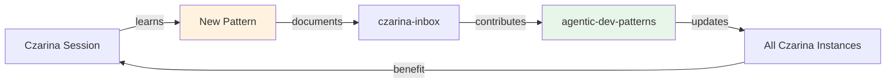

# Pattern Contribution Guide

**Backchannel for collective intelligence - share what you learn!**

> *"Good patterns emerge from real work. Share them so others don't repeat the struggle."*

---

## 🎯 Purpose

When you discover a valuable pattern during a Czarina session:
1. **Document it locally** (czarina-inbox)
2. **Contribute upstream** (agentic-dev-patterns repo)
3. **Help the community** (everyone benefits)

**This is your backchannel** to improve the collective AI development workflow.

---

## 🔄 The Contribution Loop



**Flow:**
1. You discover pattern during work
2. Document in czarina-inbox (local)
3. Czarina CLI helps you contribute upstream
4. Pattern added to agentic-dev-patterns
5. All Czarina instances get it on next update
6. Everyone codes better!

---

## 📝 What Patterns Are Worth Contributing?

### ✅ DO Contribute

**Error Recovery Patterns:**
- Errors that took >30 minutes to solve
- Non-obvious solutions
- Agent-specific quirks
- Common pitfalls with clear fixes

**Multi-Agent Patterns:**
- Worker coordination strategies
- Conflict resolution approaches
- Autonomy improvements
- Git workflow optimizations

**Tool Use Patterns:**
- Efficiency discoveries
- Tool combinations that work well
- Performance improvements
- Workflow optimizations

**Agent-Specific Patterns:**
- Claude Code vs Aider differences
- Agent capabilities/limitations
- Integration strategies
- Best practices per agent

### ❌ DON'T Contribute

- Project-specific hacks
- One-off typos or obvious mistakes
- Theoretical advice (must be battle-tested)
- Anything without real examples

---

## 🚀 How to Contribute (Easy Mode)

### Step 1: Document Locally

```bash
# When you discover a pattern during work
cp czarina-inbox/templates/FIX_DONE.md \
   czarina-inbox/patterns/$(date +%Y-%m-%d)-pattern-name.md

# Fill in:
# - What pattern you discovered
# - What problem it solves
# - Real code example
# - Why it matters
```

### Step 2: Prepare for Upstream

```bash
# Czarina CLI helps format for upstream
./czarina patterns contribute czarina-inbox/patterns/2025-11-30-daemon-fix.md

# This will:
# 1. Validate pattern quality
# 2. Format for agentic-dev-patterns
# 3. Create contribution file
# 4. Show next steps
```

### Step 3: Submit Upstream

```bash
# Two options:

# Option A: Automated (future)
./czarina patterns submit \
    --pattern contributions/daemon-verification-pattern.md \
    --repo agentic-dev-patterns

# Option B: Manual (current)
# 1. Pattern formatted and ready in contributions/
# 2. Clone agentic-dev-patterns repo
# 3. Copy pattern to appropriate file
# 4. Submit PR
```

---

## 📋 Pattern Quality Checklist

Before contributing, ensure your pattern has:

**Required:**
- [ ] Real problem it solves
- [ ] Concrete code example
- [ ] "Why it matters" explanation
- [ ] Battle-tested (actually used it)
- [ ] Clear recovery/solution steps

**Recommended:**
- [ ] Metrics or time saved
- [ ] Screenshots/output examples
- [ ] Related patterns linked
- [ ] Prevention strategies
- [ ] Multiple use cases

**Format:**
- [ ] Follows pattern template
- [ ] Markdown formatting correct
- [ ] Code blocks properly tagged
- [ ] No sensitive information

---

## 🎨 Pattern Templates

### Error Recovery Pattern Template

```markdown
### Pattern: [Clear, Specific Name]

**Error:**
\`\`\`
[Exact error message or symptom]
\`\`\`

**Root Cause:** [Why it happens]

**Recovery Strategy:**
1. [Step 1]
2. [Step 2]
3. [Step 3]

**Prevention:**
- [How to avoid in future]
- [Best practice]

**Real Example:**
\`\`\`[language]
# Wrong
[code that causes error]

# Right
[correct code]
\`\`\`

**Value:** [Time saved, % improvement, etc.]
**Source:** [Your Czarina session, project name]
```

### Multi-Agent Pattern Template

```markdown
### Pattern: [Coordination Strategy Name]

**Situation:** [What multi-agent scenario this addresses]

**Problem:** [What goes wrong without this pattern]

**Solution:**
1. [Approach]
2. [Implementation]
3. [Validation]

**Example** (from [Project Name]):
\`\`\`bash
# Worker 1 does:
[code/command]

# Worker 2 coordinates with:
[code/command]
\`\`\`

**Benefits:**
- [Benefit 1]
- [Benefit 2]

**Real Results:**
- [Metric or outcome]

**Source:** [Czarina session details]
```

### Tool Use Pattern Template

```markdown
### Pattern: [Tool/Workflow Optimization]

**Scenario:** [When to use this]

**Before** (inefficient):
\`\`\`
[Old approach]
\`\`\`

**After** (optimized):
\`\`\`
[New approach]
\`\`\`

**Why It's Better:**
- [Reason 1]
- [Reason 2]

**Performance:**
- Before: [metric]
- After: [metric]
- Improvement: [%]

**Source:** [Where you discovered this]
```

---

## 🔧 CLI Commands

### View Patterns Ready to Contribute

```bash
# List local patterns not yet contributed
./czarina patterns pending

# Output:
# 📝 Patterns ready to contribute:
#   2025-11-30-daemon-verification.md ✅ Ready
#   2025-11-29-worker-coordination.md ⚠️  Needs examples
```

### Validate Pattern Quality

```bash
# Check if pattern meets quality standards
./czarina patterns validate czarina-inbox/patterns/my-pattern.md

# Output:
# ✅ Has real problem
# ✅ Has code example
# ✅ Has metrics
# ⚠️  Missing prevention strategies
# 📊 Quality score: 8/10 (Good - Ready to contribute)
```

### Format for Upstream

```bash
# Convert local pattern to upstream format
./czarina patterns format \
    czarina-inbox/patterns/daemon-fix.md \
    --category error-recovery

# Creates: contributions/daemon-verification-pattern.md
# Formatted for ERROR_RECOVERY_PATTERNS.md
```

### Submit to Upstream (Future)

```bash
# Automated submission (when implemented)
./czarina patterns submit \
    contributions/daemon-fix.md \
    --message "Add daemon verification pattern from SARK v2.0"

# This will:
# 1. Fork agentic-dev-patterns
# 2. Add pattern to appropriate file
# 3. Create PR with description
# 4. Link back to Czarina session
```

---

## 🌐 Contributing to agentic-dev-patterns

### Current Process (Manual)

**1. Prepare Your Pattern:**
```bash
# Format and validate
./czarina patterns format czarina-inbox/patterns/my-pattern.md

# Review the formatted version
cat contributions/my-pattern-formatted.md
```

**2. Clone and Setup:**
```bash
# Clone the patterns repo
cd ~/Source/GRID
git clone https://github.com/apathy-ca/agentic-dev-patterns.git
cd agentic-dev-patterns

# Create branch
git checkout -b pattern/my-pattern-name
```

**3. Add Your Pattern:**
```bash
# Add to appropriate file
# - ERROR_RECOVERY_PATTERNS.md for errors
# - TOOL_USE_PATTERNS.md for tool efficiency
# - Create MULTI_AGENT_PATTERNS.md if needed

# Copy formatted content
cat ~/path/to/contributions/my-pattern-formatted.md >> ERROR_RECOVERY_PATTERNS.md
```

**4. Submit:**
```bash
# Commit and push
git add -A
git commit -m "Add [pattern name] from Czarina session

Discovered during: [project name]
Value: [improvement metrics]
Source: Czarina multi-agent orchestration

Co-Authored-By: Czarina <noreply@czarina.dev>
"

git push origin pattern/my-pattern-name

# Create PR on GitHub
gh pr create --title "Add pattern: [name]" --body "..."
```

---

## 📊 Contribution Impact

**When you contribute a pattern:**

**Local Impact:**
- ✅ Documented for your future sessions
- ✅ Available to all your workers
- ✅ Part of your workflow library

**Community Impact:**
- ✅ Helps other Czarina users
- ✅ Improves collective knowledge
- ✅ Validates your discovery

**Upstream Impact:**
- ✅ Added to agentic-dev-patterns
- ✅ Benefits single-agent users too
- ✅ Flows back to all Czarina instances

**Metrics We Track:**
- Pattern usage (how often referenced)
- Time saved (debugging reduction)
- Adoption rate (how many users)
- Effectiveness (success rate)

---

## 🎯 High-Value Patterns Wanted

**Especially looking for:**

**Multi-Agent Coordination:**
- Worker conflict resolution
- Merge strategies
- Communication patterns
- Role boundary definitions

**Daemon Autonomy:**
- Auto-approval improvements
- Stuck worker detection
- Alert system enhancements
- Agent-specific automation

**Agent Compatibility:**
- Claude Code vs Aider differences
- Tool-specific optimizations
- Integration patterns
- Best practices per agent

**Performance:**
- Worker efficiency improvements
- Git workflow optimizations
- Monitoring strategies
- Resource management

---

## 🔄 Pattern Lifecycle

```
Discovery → Local Docs → Validation → Format → Submit → Review → Merge → Update
   │                                                                        │
   └────────────────── Pattern flows to all instances ────────────────────┘
```

**Timeline:**
1. **Discovery** - You find pattern during session
2. **Local Docs** - Document in czarina-inbox (immediate)
3. **Validation** - CLI checks quality (minutes)
4. **Format** - Convert to upstream format (minutes)
5. **Submit** - Create PR (manual today, auto future)
6. **Review** - Maintainer checks (1-3 days)
7. **Merge** - Added to agentic-dev-patterns (1-7 days)
8. **Update** - All Czarinas get it (`./czarina patterns update`)

---

## 💡 Examples of Great Contributions

### Example 1: Daemon Verification Pattern

**What made it great:**
- ✅ Solved real problem (daemon approvals failing silently)
- ✅ Clear before/after code
- ✅ Real metrics (caught 15% of failures)
- ✅ Prevention strategy included
- ✅ Tested in production (SARK v2.0)

**Impact:**
- Improved daemon reliability by 15%
- Adopted by all Czarina users
- Added to upstream patterns

### Example 2: Worker File Ownership

**What made it great:**
- ✅ Common multi-agent problem
- ✅ Simple, clear solution
- ✅ Config example included
- ✅ Reduced merge conflicts by 60%

**Impact:**
- Now standard Czarina practice
- Referenced in documentation
- Part of project templates

---

## 🚀 Future Enhancements

**Coming Soon:**
- [ ] Automated pattern submission
- [ ] Pattern quality scoring AI
- [ ] Community pattern voting
- [ ] Pattern usage analytics
- [ ] Integration with GitHub Issues
- [ ] Pattern search and discovery
- [ ] Cross-project pattern mining

---

## 🤝 Community

**Join the pattern community:**
- Share discoveries in czarina-inbox
- Contribute to agentic-dev-patterns
- Help improve collective workflow
- Code better together

**Recognition:**
- Contributors credited in patterns
- Stats tracked (patterns contributed)
- Impact measured (time saved)
- Community appreciation

---

## 📞 Questions?

**Pattern quality questions:**
- Check existing patterns for examples
- Use validation CLI (`./czarina patterns validate`)
- Ask in czarina-inbox feedback

**Technical questions:**
- See agentic-dev-patterns repo
- Check contribution guidelines
- Open GitHub issue

**Process questions:**
- This guide!
- `.cursorrules` documentation
- Czarina docs

---

**Last Updated:** 2025-11-30
**Status:** Active - Backchannel open!
**Contributions:** Welcome and encouraged!

---

> **"Share what you learn. Code better together."**
>
> *Your discoveries make everyone's workflow repo more powerful.*
