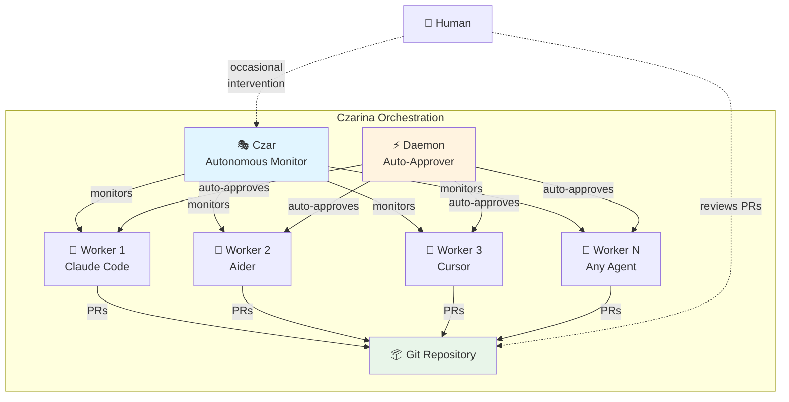
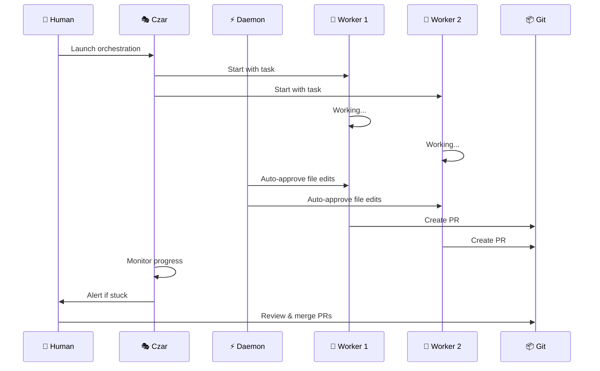
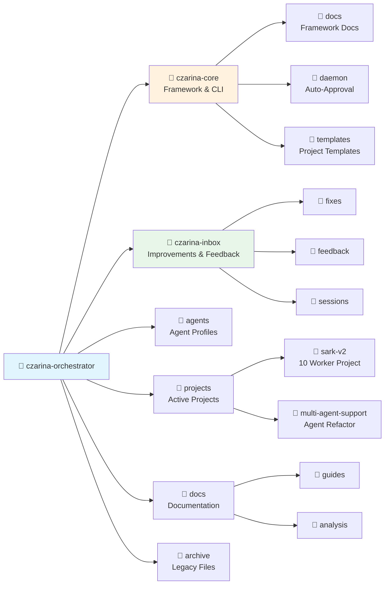
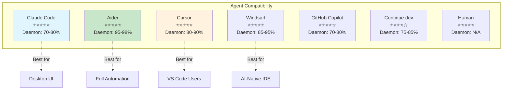
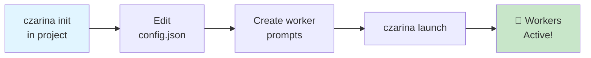
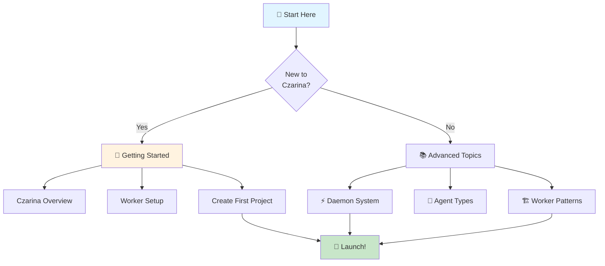

# Czarina Architecture

Complete visual guide to Czarina's architecture, workflows, and system design.

---

## 🏗️ System Architecture



**Components:**
- **Czar** - Autonomous coordinator monitoring all workers
- **Daemon** - Auto-approval system (90% autonomy)
- **Workers** - AI coding agents (any tool)
- **Git** - Version control and integration point
- **Human** - Sets goals, reviews results

---

## 🔄 Workflow Sequence



**Flow:**
1. Human launches orchestration
2. Czar starts workers with tasks
3. Workers code independently
4. Daemon auto-approves operations
5. Workers create PRs
6. Czar monitors and alerts
7. Human reviews and merges

---

## 📁 Repository Structure



---

## 🤖 Agent Compatibility



---

## 🏗️ Project Creation Flow



---

## 📖 Documentation Navigation



---

## 🎭 Czar Components

### Autonomous Coordinator
**Responsibilities:**
- Monitor all worker sessions
- Detect stuck/idle workers
- Inject tasks and guidance
- Provide real-time dashboard
- Manage Git workflow

### Implementation
- Tmux session monitoring
- Git status checking
- Alert system (JSON)
- Health detection
- Task injection

---

## ⚡ Daemon System

### Auto-Approval Flow
**Process:**
1. Watch worker tmux sessions
2. Detect approval prompts
3. Auto-approve (read/write/commit)
4. Verify approval worked
5. Alert if stuck

### Autonomy Levels
- **Aider:** 95-98% (best)
- **Windsurf:** 85-95%
- **Cursor:** 80-90%
- **Claude Code:** 70-80%
- **Copilot:** 70-80%
- **Continue.dev:** 75-85%

---

## 🔀 Git Workflow

### Branch Strategy
```
main
├── feat/worker1-backend
├── feat/worker2-frontend
├── feat/worker3-tests
└── feat/workerN-task
```

### Integration Process
1. Each worker: own branch
2. Work independently
3. Create PR when done
4. Human reviews
5. Merge to main

---

## 📊 Pattern Library

### Error Recovery
- **Location:** `czarina-core/patterns/ERROR_RECOVERY_PATTERNS.md`
- **Benefit:** 30-50% faster debugging
- **Auto-updates:** `czarina patterns update`

### Czarina-Specific
- **Location:** `czarina-core/patterns/czarina-specific/CZARINA_PATTERNS.md`
- **Focus:** Multi-agent coordination
- **Community:** Backchannel contributions

---

## 🏛️ System Design Principles

### Agent-Agnostic
**Universal Standards:**
- 📄 Files (markdown prompts)
- 🔀 Git (branches, PRs)
- 🖥️ Shell (standard commands)

**Not Used:**
- ❌ Agent-specific APIs
- ❌ Proprietary formats
- ❌ Vendor SDKs

### Embedded Orchestration
**`.czarina/` directory:**
```
.czarina/
├── config.json           # Worker configuration
├── workers/              # Worker prompts
│   ├── backend.md
│   ├── frontend.md
│   └── tests.md
├── status/               # Runtime logs (gitignored)
└── README.md             # Quick reference
```

**Benefits:**
- Version-controlled with project
- Portable across machines
- Shareable with team
- No external dependencies

---

## 🎯 Scale Testing: SARK v2.0

### Configuration
- **Workers:** 10 (6 engineers, 2 QA, 2 docs)
- **Timeline:** 6-8 weeks
- **Speedup:** 3-4x
- **Autonomy:** 90%

### Results
- ✅ Clean git workflow
- ✅ Minimal conflicts
- ✅ High-quality PRs
- ✅ 90% autonomous operation
- ✅ Alert system caught all stuck workers

---

## 🔮 Future Architecture

### Planned Enhancements
- Web dashboard (real-time monitoring)
- Enhanced alert integrations
- More agent profiles
- Advanced coordination patterns
- Multi-machine support

---

**See Also:**
- [README.md](../README.md) - Main overview
- [QUICK_START.md](../QUICK_START.md) - Getting started
- [czarina-core/docs/](../czarina-core/docs/) - Framework docs
