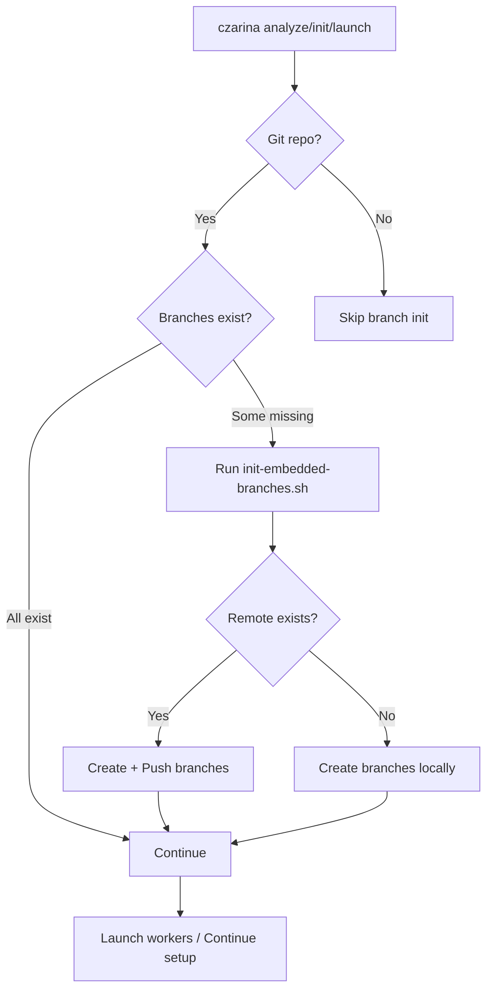

# Automatic Branch Initialization

## Overview

Czarina now **automatically initializes git branches** for all workers in three places:

1. ✅ `czarina analyze plan.md --init` - During project analysis
2. ✅ `czarina init` - During manual initialization
3. ✅ `czarina launch` - When launching workers (if branches missing)

This means you **never have to manually create branches** - they're created automatically when you need them!

## How It Works

### During Project Setup

```bash
# Option 1: Analyze and initialize
czarina analyze implementation-plan.md --init

# Option 2: Manual initialization
czarina init my-project
```

**What happens**:
1. Reads worker definitions from `config.json`
2. For each worker, creates a branch (e.g., `feat/v0.1.0-backend-attention-service`)
3. Pushes branches to remote (if remote exists)
4. Installs `.czarina/load-worker-by-branch.sh` script
5. Updates `.gitignore`

### During Launch

```bash
cd ~/my-project
czarina launch
```

**What happens**:
1. Checks if worker branches exist
2. If any are missing, automatically runs branch initialization
3. Then proceeds to launch workers

This safety net ensures branches always exist before workers start.

## Branch Naming Convention

Branches are automatically named based on worker configuration:

```json
{
  "workers": [
    {
      "id": "backend-attention-service",
      "branch": "feat/v0.1.0-backend-attention-service"
    }
  ]
}
```

**Convention**: `feat/<version>-<worker-id>`

Examples:
- `feat/v0.1.0-backend-attention-service`
- `feat/v0.1.0-sage-loop-integrator`
- `feat/v0.2.0-qa-integration-tests`

## Complete Workflow Examples

### Example 1: New Project from Plan

```bash
# You have an implementation plan
cd ~/myproject
vim implementation-plan.md

# Analyze and initialize in ONE command
czarina analyze implementation-plan.md --init

# Everything is now set up:
# ✅ .czarina/config.json created
# ✅ .czarina/workers/*.md created
# ✅ All git branches created and pushed
# ✅ .czarina/load-worker-by-branch.sh installed
# ✅ .gitignore updated

# Workers can immediately start:
git checkout feat/v0.1.0-backend-attention-service
# Agent auto-loads prompt (if hook configured)
```

### Example 2: Manual Setup

```bash
cd ~/myproject
git init
git add .
git commit -m "Initial commit"

# Initialize Czarina
czarina init

# Automatically:
# ✅ Creates .czarina/ structure
# ✅ Creates example worker
# ✅ Creates git branch for worker
# ✅ Pushes to remote (if configured)

# Edit workers
vim .czarina/config.json  # Add workers
vim .czarina/workers/worker2.md  # Define new worker

# Launch (will create any missing branches)
czarina launch
```

### Example 3: Existing Project (Branches Missing)

```bash
# Clone an existing Czarina project
git clone https://gitlab.com/myproject.git
cd myproject

# .czarina/ exists but branches don't (yet)
# Just launch - branches auto-created!
czarina launch

# Output:
# 🌿 Some worker branches don't exist yet. Initializing...
# ✅ Git branches initialized
# 🚀 Launching workers...
```

## Branch Initialization Script

Located at: `czarina-core/init-embedded-branches.sh`

**What it does**:
1. Reads `.czarina/config.json`
2. Extracts worker branch names
3. Checks if branches exist (locally or remotely)
4. Creates missing branches from main/master
5. Pushes new branches to remote (if configured)
6. Handles existing branches with uncommitted work

**Safety features**:
- ✅ Never deletes branches with commits
- ✅ Skips if branch exists remotely
- ✅ Auto-detects main vs master branch
- ✅ Works with or without remote
- ✅ Non-destructive (won't overwrite work)

## Commands That Auto-Initialize Branches

| Command | When It Initializes Branches |
|---------|------------------------------|
| `czarina analyze plan.md --init` | ✅ Always (if git repo exists) |
| `czarina init` | ✅ Always (if git repo exists) |
| `czarina launch` | ✅ If any worker branches are missing |
| Manual branch creation | ❌ Never (you're on your own) |

## Branch Detection Logic

The system checks for missing branches using:

```bash
git show-ref --verify --quiet refs/heads/<branch-name>
```

If missing, it creates the branch from current `main` or `master`.

## Integration with Worker Isolation

Once branches exist, Czarina uses **git worktrees** for true parallel development:

1. **Launch creates worktrees**: Each worker gets `.czarina/worktrees/worker-id/`
2. **Worker operates in worktree**: Isolated workspace on their branch
3. **No conflicts**: Multiple workers can work simultaneously
4. **SessionStart hook**: Workers auto-load their prompt in their worktree

**Architecture:**
```
project/
├── .git/                           # Main repo
├── .czarina/
│   └── worktrees/
│       ├── worker1/                # Isolated worktree (on feat/worker1)
│       ├── worker2/                # Isolated worktree (on feat/worker2)
│       └── worker3/                # Isolated worktree (on feat/worker3)
```

See: [Git Worktrees Documentation](https://git-scm.com/docs/git-worktree)

## Non-Git Projects

If your project is not a git repository:

```bash
czarina init

# Output:
# ⚠️  Not a git repository - skipping branch initialization
# ✅ Czarina initialized successfully!
```

Workers can still use Czarina orchestration, but worktrees won't be used. They'll work in the main directory and need to manually load prompts:

```bash
./.czarina/.worker-init backend-attention-service
```

## Remote Repository Support

### With Remote

```bash
git remote add origin https://gitlab.com/myproject.git
czarina init

# Branches are pushed to remote automatically:
# ✅ feat/v0.1.0-backend-attention-service pushed
# ✅ feat/v0.1.0-sage-loop-integrator pushed
```

### Without Remote (Local Only)

```bash
# No remote configured
czarina init

# Branches created locally only:
# ✅ feat/v0.1.0-backend-attention-service created
# ⚠️  Not pushed (no remote)
```

Later when you add a remote:

```bash
git remote add origin https://gitlab.com/myproject.git
git push --all origin  # Push all branches
```

## Troubleshooting

### Branches not created

**Check if git repo exists**:
```bash
ls -la .git
# Should exist
```

**Check config.json**:
```bash
cat .czarina/config.json | jq '.workers[].branch'
# Should show branch names
```

**Manually run initialization**:
```bash
./czarina-core/init-embedded-branches.sh .
```

### Branches exist but can't checkout

**Fetch from remote**:
```bash
git fetch --all
git checkout feat/v0.1.0-backend-attention-service
```

### Wrong branch created

**Check config.json branch names**:
```bash
vim .czarina/config.json
# Edit worker.branch field
```

**Delete and recreate**:
```bash
git branch -D feat/wrong-name
czarina launch  # Will recreate with correct name
```

### Push rejected (remote exists)

```bash
# Remote branch already exists with different history
git fetch origin
git checkout -b feat/v0.1.0-worker origin/feat/v0.1.0-worker
```

## Benefits

### ✅ Zero Manual Setup
- No need to remember branch names
- No typos in branch creation
- Consistent naming across projects

### ✅ Fail-Safe
- `czarina launch` always ensures branches exist
- Can't launch without proper branch setup
- Prevents worker confusion

### ✅ Onboarding Friendly
- New team members just run `czarina launch`
- Branches auto-created on first run
- No manual git commands needed

### ✅ Works Everywhere
- Works with any git hosting (GitLab, GitHub, Gitea, etc.)
- Works with local-only repos
- Works with SSH or HTTPS remotes

## Architecture



## Related Documentation

- [Branch-Based Worker Loading](BRANCH_BASED_WORKER_LOADING.md) - How workers auto-load prompts
- [Embedded Orchestration](../czarina-core/templates/embedded-orchestration/README.md) - Project structure
- [Quick Start](../QUICK_START.md) - Getting started guide

## See Also

**Scripts**:
- `czarina-core/init-embedded-branches.sh` - Branch initialization script
- `czarina-core/templates/embedded-orchestration/load-worker-by-branch.sh` - Branch detection script

**Commands**:
- `czarina analyze plan.md --init` - Analyze and initialize
- `czarina init` - Manual initialization
- `czarina launch` - Launch with auto-branch-init
- `czarina list` - List projects
- `czarina status` - Show project status

---

**Last Updated**: 2025-12-04
**Status**: Active - All initialization commands now auto-create branches
